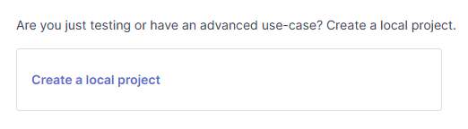
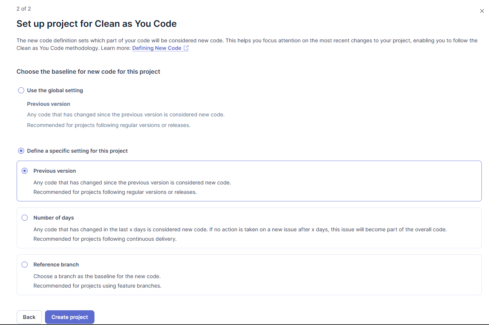
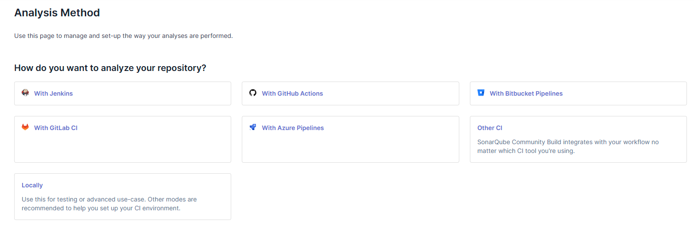
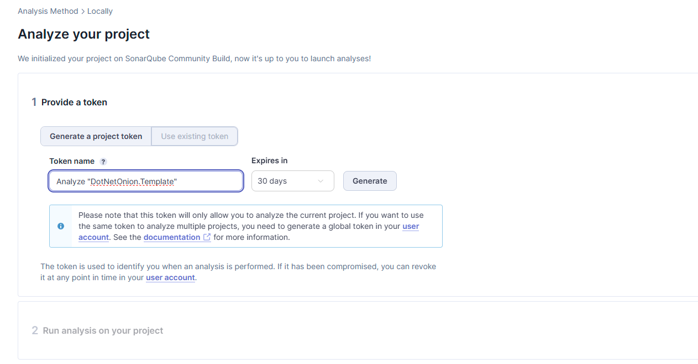
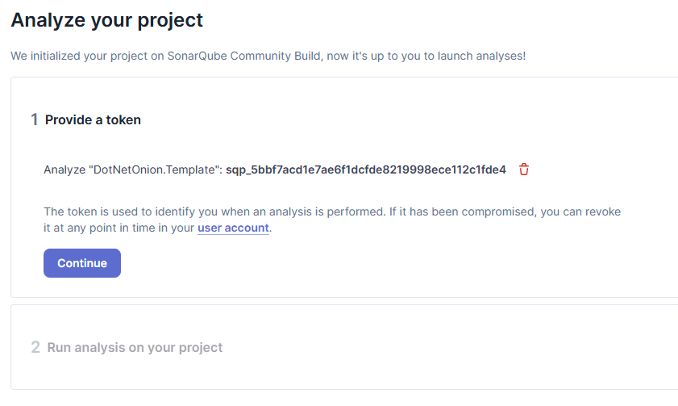
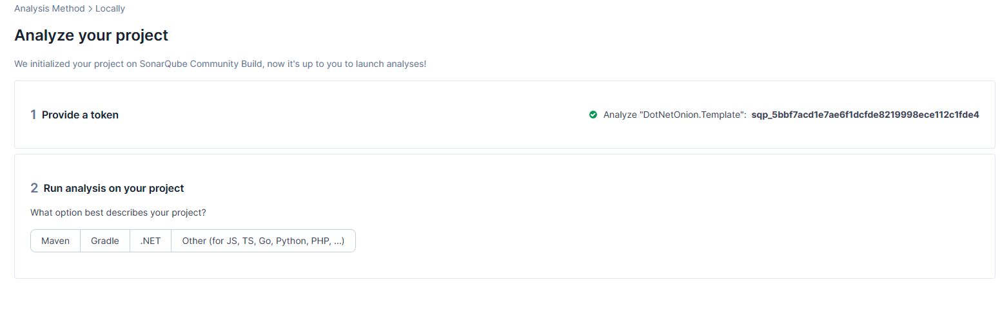
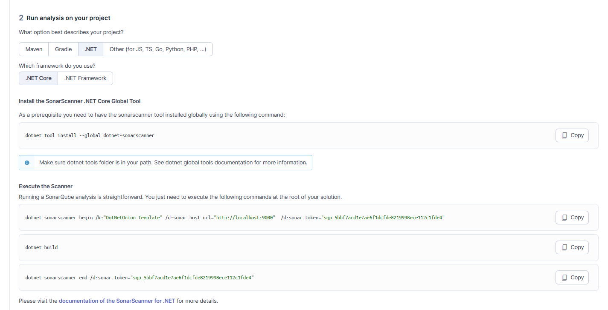

# SonarQube com Docker Compose

Este repositório configura o SonarQube e o PostgreSQL usando Docker Compose.

## Configuração e Inicialização

1. Clone o repositório e navegue até a pasta:
   ```sh
   git clone <repo_url>
   cd sonar-labs
   ```
2. Inicie os containers:
   ```sh
   docker compose up -d
   ```
3. Acesse o SonarQube em: [http://localhost:9000](http://localhost:9000)
4. Primeiro acesso:
   - Usuário: **admin**
   - Senha: **admin**

## Configuração do Projeto no SonarQube

1. Crie um novo projeto no SonarQube.  
   
2. Configure como "Clean as You Code".  
   
3. Escolha "Analysis Method" como **Locally**.  
   
4. Clique em **Generate**.  
   
5. Clique em **Continue**.  
   
6. Escolha a opção **.NET**.  
   
7. Execute os comandos sugeridos na tela.  
   

## Comando de Análise do SonarScanner

Execute o seguinte comando para iniciar a análise:
```sh
dotnet sonarscanner begin /k:"DotNetOnion.Template" \  
  /d:sonar.host.url="http://localhost:9000" \  
  /d:sonar.token="sqp_5bbf7acd1e7ae6f1dcfde8219998ece112c1fde4" \  
  /d:sonar.scanner.scanAll=false
```

**Por que usar `/d:sonar.scanner.scanAll=false`?**  
Caso essa opção não seja utilizada, a análise será executada em múltiplas linguagens, incluindo arquivos que podem não ser relevantes, o que pode levar a problemas como:
- Estouro do limite de linhas de código (LOC) no SonarQube.
- Análise de arquivos indesejados.
- Maior tempo de execução da análise.

Para evitar esses problemas, é recomendável usar `/d:sonar.scanner.scanAll=false`, garantindo que apenas as mudanças relevantes sejam analisadas.

Se houver mais de uma solution no projeto, especifique:
```sh
dotnet build .\DotNetOnion.Template.sln
```
